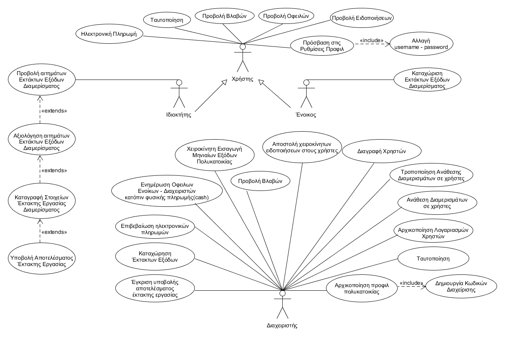

# INF138 Project Template

Ένα απλό πρότυπο οργάνωσης του κώδικα και της τεχνικής τεκμηρίωσης για τις εξαμηνιαίες εργασίες του μαθήματος Τεχνολογία Λογισμικού ([INF138](https://eclass.aueb.gr/courses/INF138/)) του Τμήματος Πληροφορικής Οικονομικού Πανεπιστημίου Αθηνών.

Η τρέχουσα έκδοση περιλαμβάνει την [προδιαγραφή των απαιτήσεων λογισμικού](docs/markdown/software-requirements.md) με προσαρμογή του `IEEE Std 830-1998` για την ενσωμάτωση απαιτήσεων σε μορφή περιπτώσεων χρήσης. Για περισσότερες λεπτομέρειες μπορείτε να ανατρέξετε στο βιβλίο [Μ Γιακουμάκης, Ν. Διαμαντίδης, Τεχνολογία Λογισμικού, Σταμούλης, 2009](https://www.softeng.gr).

# Οδηγίες χρήσης

Στην παρούσα αρχική σελίδα `README.md` προσθέστε σε μορφή Markdown την περιγραφή του Project όπως σας ζητείται στο παραδοτέο R1. Στη σελίδα αυτή θα προστεθούν σύνδεσμοι προς τα έγγραφα Markdown που περιλαμβάνουν την προδιαγραφή και ανάλυση των απαιτήσεων [software-requirements.md](docs/markdown/software-requirements.md) και τη σχεδίαση του συστήματος [design.md](docs/markdown/design.md).

Η τεκμηρίωση/διαγράμματα που ζητούνται στα επόμενα παραδοτέα θα τοποθετηθούν στους εξής φακέλους:
* `docs/markdown`: αρχεία Markdown με την τεκμηρίωση του συστήματος που απαιτείται για τα παραδοτέα R2-R4. H τεκμηρίωση θα συμπεριληφθεί στα ακόλουθα αρχεία:
     *  `software-requirements.md`: προδιαγραφή και ανάλυση των απαιτήσεων. Προκειμένου να διευκολυνθεί η συνεργασία σας, οι περιγραφές των περιπτώσεων χρήσης μπορούν να εισαχθούν σε διαφορετικά αρχεία `*.md`. Προϋπόθεση είναι να υπάρχουν κατάλληλοι σύνδεσμοι από το `software-requirements.md` προς αυτά έτσι ώστε να διευκολύνεται η πλοήγηση στην τεκμηρίωση μέσω του Gitlab. Τα διαγράμματα που θα δημιουργηθούν στα πλαίσια του R2 θα ενσωματωθούν στα παραπάνω έγγραφα (δεν θα λάβουμε υπόψιν διαγράμματα με μορφή εικόνας/uxf που δεν θα φαίνονται ως μέρος της τεκμηρίωσης).
     *  `design.md`: περιγραφή της σχεδίασης του συστήματος όπως ζητείται στα παραδοτέα R3 και R4. To έγγραφο θα ενσωματώνει όλα τα διαγράμματα που θα δημιουργηθούν στα παραδοτέα R3, R4. Οι εικόνες των διαγραμμάτων θα είναι διαθέσιμες στο φάκελο `docs/markdown/uml`, όπως παράγονται από το εργαλείο Gradle.
* `docs/uml`: αρχεία Umlet (`*.uxf`) με τα διαγράμματα που έχουν υλοποιηθεί στα πλαίσια των παραδοτέων R2-R4. Μπορούν να οργανωθούν σε υποφακέλους (πχ. `requirements`, `design`).

Η αυτοματοποιημένη μετατροπή των διαγραμμάτων Umlet σε PNG εικόνες, έτοιμες προς ενσωμάτωση στην Markdown τεκμηρίωσή σας μπορεί να γίνει με χρήση του εργαλείου Gradle. Προϋπόθεση για τη σωστή λειτουργία της διαδικασίας είναι η [λήψη](https://maven.apache.org/download.cgi), [εγκατάσταση](https://maven.apache.org/install.html) και προσθήκη στο PATH του συστήματος του εργαλείου Maven.

Μετά την εγκατάσταση του Maven, μπορείτε να παράξετε όλα τα διαγράμματα που βρίσκονται στον κατάλογο `docs\uml` (και υποκαταλόγους) με τη βοήθεια του Gradle (δε χρειάζεται εγκατάσταση):

Από γραμμή εντολών Windows:
```bash
gradlew.bat umlet
```

Από γραμμή εντολών Linux:
```bash
./gradlew umlet
```

Η εκτέλεση της εντολής θα εγκαταστήσει το Gradle και θα παράξει τα διαγράμματα στον κατάλογο `docs\markdown\uml` διατηρώντας την οργάνωση σε καταλόγους των Umlet αρχείων. Στη συνέχεια, μπορείτε να ενσωματώσετε στην τεκμηρίωσή σας τις εικόνες του παραπάνω καταλόγου.

# Παραδοτέο R1-Περιγραφή του πεδίου προβλήματος.




**Απαιτήσεις:**
1. Θα υποστηρίζεται **αρχικοποίηση** προφίλ πολυκατοικίας (διέυθυνση, όροφοι, διαμερίσματα, τύπος θέρμανσης, ύπαρξη ασανσέρ, κοινόχρηστοι χώροι,
τραπεζικός λογαριασμός για πληρωμή κοινοχρήστων) με τα στοιχεία της απο το διαχειριστή.
2. Θα υποστηρίζεται **αρχικοποίηση** λογαριασμού για κάθε ένοικο/ιδιοκτήτη απο τον διαχειριστή.
3. Θα υποστηρίζεται αντιστοίχηση λογαριασμού ενοίκου/ιδιοκτήτη με το αντίστοιχο διαμερισμά απο το διαχειριστή.
4. Ο διαχειριστής εισάγει τα **κοινόχρηστα**(θέρμανση, ΔΕΗ κλπ) και τα έκτακτα έξοδα της πολυκατοικίας.
5. Με βάση τα δοθέντα στοιχεία, το σύστημα υπολογίζει κάθε μήνα τα **κοινόχρηστα έξοδα**.
6. Το σύστημα θα αποστέλλει αυτόματα ειδοποίηση με τα **κοινόχρηστα** έξοδα στους ενοίκους.
7. Το σύστημα αποστέλλει αυτόματα τα έκτακτα έξοδα της πολυκατοικίας στους ιδιοκτήτες.
8. Θα υποστηρίζονται γενικές ενημερώσεις (*notifications*) των ενοίκων απο το διαχειριστή (*π.χ. "Καθαρισμός πολυκατοικίας απο συνεργείο "ΑΒΓ" στις 12.04.2021, ωρα 11.00πμ*).
9. Θα υποστηρίζεται **διαγραφή** ενός χρήστη απο το διαχειριστή.
10. Το σύστημα υποστηρίζει **ταυτοποίηση** χρηστών.
11. Ο διαχειριστής, ο ένοικος και ο ιδιοκτήτης εισέρχονται στην εφαρμογή μέσω του **σταδίου ταυτοποίησης**.
12. Ο ένοικος έχει τη δυνατότητα να προβάλλει τις **οφειλές** του.
13. Ο διαχειριστής, ο ένοικος και ο ιδιοκτήτης έχουν τη δυνατότητα να δουν ειδοποίησεις.
14. Ο διαχειριστής ενημερώνει το σύστημα για την **εξόφληση ποσών** απο τους ενοίκους.
15. Το σύστημα υποστηρίζει ενημέρωση οφειλών έπειτα απο τη **φυσική πληρωμή**(*μετρητά*) απο τον ένοικο.
16. Το σύστημα υποστηρίζει **ηλεκτρονική πληρωμή**(*χρεωστική/πιστωτική κάρτα, PayPal*) απο τον ένοικο.
17. Στη περίπτωση ηλεκτρονικής πληρωμής, το σύστημα στέλνει *αυτόματα* αίτημα έγκρισης εξόφλησης ηλεκτρονικής πληρωμής στο διαχειριστή.
18. Ο ένοικος καταχωρεί **έκτακτες** εργασίες επισκευής του διαμερίσματος.
19. Το σύστημα στέλνει αυτόματα ενημέρωση στον ιδιοκτήτη για αίτημα έκτακτων επισκευών ενοίκου.
20. Ο ιδιοκτήτης έχει τη δυνατότητα να προβάλλει αιτήματα έκτακτων επισκευών του διαμερίσματος του.
21. Ο ιδιοκτήτης εγκρίνει ή απορρίπτει τα αιτήματα έκτακτων επισκευών του διαμερίσματος του.
22. Ο ιδιοκτήτης καταγράφει τα στοιχεία(*χρονικό διάστημα, κόστος*) της έκτακτης εργασίας.
23. Ο ιδιοκτήτης καταχωρεί το αποτέλεσμα της έκτακτης εργασίας.
24. Ο διαχειριστής εγκρίνει το αποτέλεσμα της έκτακτης εργασίας.
25. Μόλις ο ιδιοκτήτης εγκρίνει την έκτακτη εργασία, το σύστημα προσθέτει την εργασία ως καταχώρηση στις **Βλάβες**.
26. Ο ιδιοκτήτης έχει τη δυνατότητα να προβάλλει τις **οφειλές** του(οφειλές συντήρησης και εκτάκτων εξόδων).
27. Το σύστημα υποστηρίζει ενημέρωση οφειλών έπειτα απο τη φυσική πληρωμή(*μετρητά*) απο τον ιδιοκτήτη.
28. Το σύστημα υποστηρίζει ηλεκτρονική πληρωμή (*χρεωστική/πιστωτική κάρτα, PayPal*) απο τον ιδιοκτήτη.
29. Ο διαχειριστής, ο ένοικος και ο ιδιοκτήτης μπορούν να προβάλουν τις **βλάβες** της πολυκατοικίας.
30. Μετά τη **διαγραφή** ενός ενοίκου, το σύστημα μεταφέρει τις οφειλές του **διαγραφέντος ενοίκου** στον ιδιοκτήτη του διαμερίσματος.
31. Ο χρήστης έχει τη δυνατοτήτα να αλλάξει τα **στοιχεία** του(π.χ. *κωδικοί εισόδου στην εφαρμογή*).
32. Ο χρήστης έχει τη δυνατότητα να προβάλλει το **προφίλ** του.
33. Ο διαχειριστής μπορεί να τροποποιήσει την ανάθεση ενός διαμερίσματος(π.χ. *πώληση του διαμερίσματος σε νέο ιδιοκτήτη*)


